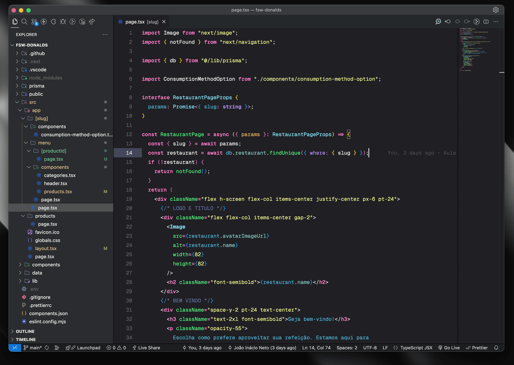

# Xcode Dracula Theme

A VS Code theme inspired by Xcode and Dracula.

<p align="center">
  
</p>

## Installation

1. Open the Extensions sidebar in VS Code.
2. Search for `Xcode Dracula Theme` or visit the [Visual Studio Marketplace](https://marketplace.visualstudio.com/items?itemName=birobirobiro.xcode-dracula-theme).
3. Click `Install` to install the theme.
4. Navigate to File > Preferences > Color Theme > Xcode Dracula Theme to activate the theme.

## Font

This theme uses the [Geist Mono](https://vercel.com/font) font.

## Icon Packages

For the best experience, it is recommended to use the following icon packages:

- [Symbols](https://marketplace.visualstudio.com/items?itemName=miguelsolorio.symbols)
- [Fluent Icons](https://marketplace.visualstudio.com/items?itemName=miguelsolorio.fluent-icons)

## Contributing and Development

> Feel free to open issues or submit pull requests if you find any bugs or have suggestions for improvements.

To install, generate, and test the theme locally, follow these steps:

1. Install `vsce` globally:

   ```sh
   npm install -g @vscode/vsce
   ```

2. Package the extension:

   ```sh
   vsce package
   ```

3. Install the generated VSIX file:
   - On Windows/Linux: Press `Ctrl + Shift + P` and select `Install from VSIX...`
   - On macOS: Press `Cmd + Shift + P` and select `Install from VSIX...`

## License

This project is licensed under the MIT License.
